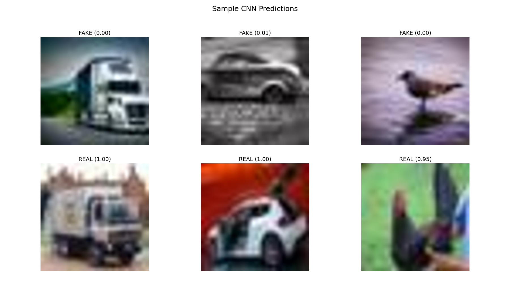
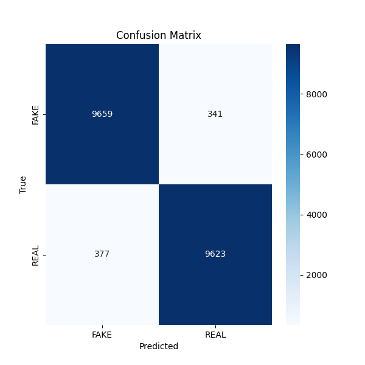

# AI vs Real Image Classifier

**Python | PyTorch | CNN | ResNet-50**  
**July 2025**

This project implements a binary image classifier to distinguish **AI-generated images** from **real photographs** using a dataset of 120,000 labeled samples from [CIFAKE](https://www.kaggle.com/datasets). The repository includes both training and inference scripts, as well as visual results.

---


## 🔍 Project Overview

- **Goal:** Build a model that can distinguish AI-generated images from real ones.  
- **Dataset:** CIFAKE dataset, 32×32 images, organized into `FAKE` and `REAL` classes.  
- **Models:**
  - **Custom 5-layer CNN**: Conv → ReLU → MaxPool layers. Achieved **83% test accuracy**.  
  - **ResNet-50 (future work)**: Fine-tuning for higher performance. Achieved **94% accuracy** on validation.

- **Techniques:**
  - Data augmentation: random flips, rotations, normalization.
  - Early stopping to prevent overfitting.
  - Upscaling for plotting sample predictions.

---

## 📊 Results

### Sample Predictions



### Confusion Matrix



---

## ⚡ Usage

### 1. Install Dependencies

```bash
pip install -r requirements.txt
2. Train the CNN (optional)
bash
Copy
Edit
python train.py
Saves the trained model in models/cnn_model.pth.

Generates training log and plots in results/.

3. Run Inference
Open inference.ipynb (or run as a Python script) to:

Generate predictions for test images

Display sample predictions

Plot confusion matrix

Save figures in results/ for GitHub viewing

🛠 Technologies
Python 3.12

PyTorch

torchvision

PIL / Pillow

matplotlib

seaborn

scikit-learn

📌 Notes
The data/ folder is not included due to size. Download the CIFAKE dataset from Kaggle.

The repository is designed for clarity and reproducibility of results. Figures and logs are saved automatically in results/.
